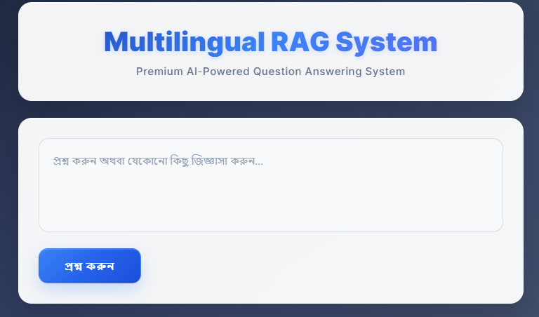
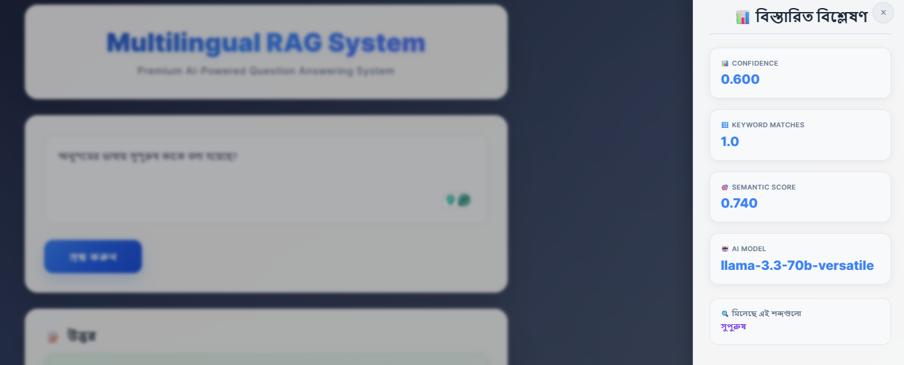
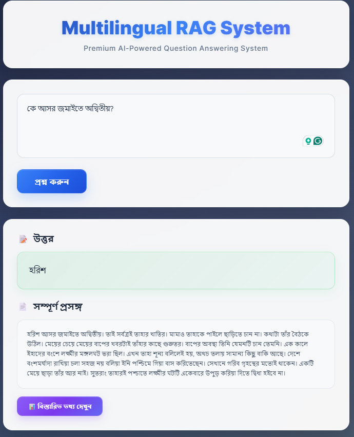
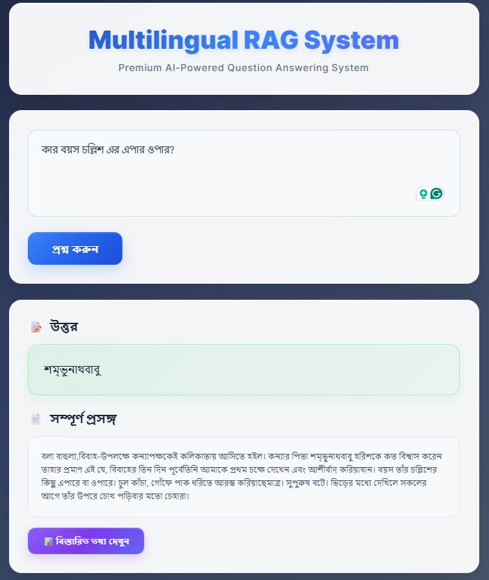
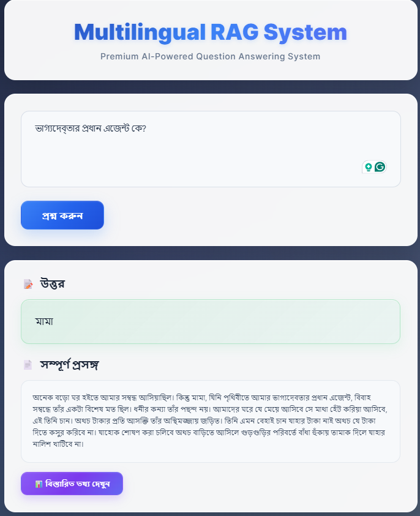
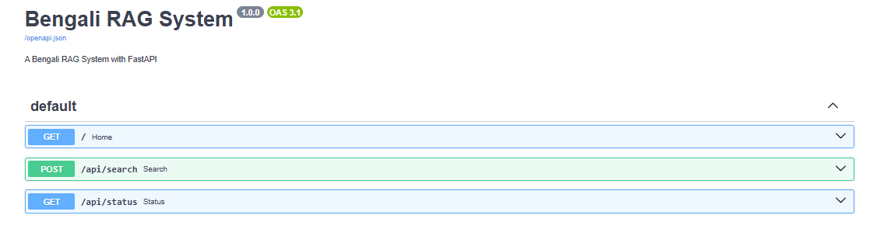
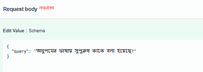
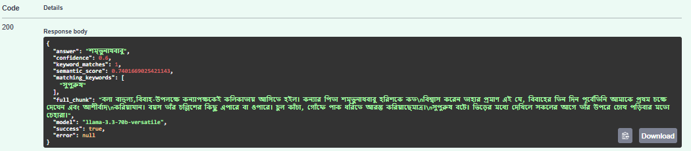

# Multilingual RAG System

A sophisticated **Retrieval-Augmented Generation (RAG) system** that can intelligently answer questions in **Bengali and English** from uploaded PDF documents using state-of-the-art AI technology. This system combines advanced text processing, multilingual embeddings, and powerful language models to provide accurate, context-aware responses.

## 🚀 Project Overview

This project implements a complete end-to-end RAG pipeline that can:
- **Extract and process text** from PDF documents (including scanned Bengali documents)
- **Pre processed the text** from the extracted text.
- **Chunked the preprocessed text** for better understand for embedding
- **Stored the chunks** to the vector database
- **Generate multilingual embeddings** for semantic search
- **Answer complex questions** using AI with proper context retrieval
- **Provide a modern web interface** with premium UI/UX design
- **Support cross-lingual queries** with automatic language detection

The system is particularly optimized for Bengali literature and can handle complex literary texts like "Oporichita" by Rabindranath Tagore.

## ⚙️ Project Setup

### Prerequisites

Before setting up the project, ensure you have the following installed:

- **Python 3.8+** 
- **Git**
- **Tesseract OCR** (for PDF text extraction)
- **Groq API Key** (for AI-powered answer generation)

### Step 1: Clone the Repository

```bash
git clone https://github.com/adibmahmud007/Bangla-RAG-Agent.git
cd multilingual-rag-system
```

### Step 2: Create Virtual Environment

```bash
# Create virtual environment
python -m venv venv

# Activate virtual environment
# On Windows:
venv\Scripts\activate
# On macOS/Linux:
source venv/bin/activate
```

### Step 3: Install Dependencies

```bash
# Install core dependencies
pip install fastapi uvicorn python-multipart
pip install sentence-transformers scikit-learn numpy pandas
pip install groq python-dotenv
pip install faiss-cpu
pip install pytesseract pdf2image Pillow
pip install pydantic

# For development
pip install pytest black flake8
```

### Step 4: Install Tesseract OCR

#### Windows:
1. Download Tesseract from: https://github.com/UB-Mannheim/tesseract/wiki
2. Install and add to PATH
3. Download Bengali language pack

#### macOS:
```bash
brew install tesseract tesseract-lang
```

#### Ubuntu/Linux:
```bash
sudo apt update
sudo apt install tesseract-ocr tesseract-ocr-ben
sudo apt install poppler-utils
```

### Step 5: Environment Configuration

Create a `.env` file in the root directory:

```env
# Groq API Configuration
GROQ_API_KEY=your_groq_api_key_here

# Tesseract Configuration (Windows only)
TESSERACT_CMD=C:\Program Files\Tesseract-OCR\tesseract.exe

# Optional: Model configurations
EMBEDDING_MODEL=paraphrase-multilingual-MiniLM-L12-v2
GROQ_MODEL=llama-3.3-70b-versatile
```

### Step 6: Prepare Your Data

1. Place your PDF documents in the `data/` directory
2. The system currently includes `hsc26_bangla1.pdf` as sample data
3. Run the rag model :

```bash
python app/rag_model.py
```

### Step 7: Run the Application

```bash
# Start the FastAPI server
uvicorn main:app --host 0.0.0.0 --port 8000 --reload
```

The application will be available at:
- **Web Interface**: http://localhost:8000
- **API Documentation**: http://localhost:8000/docs
- **Alternative Docs**: http://localhost:8000/redoc
- **Health Check**: http://localhost:8000/api/status

## 📸 Sample Output

### 1. Web Interface
<br>
*Premium glass morphism design with Bengali question input and AI-powered answer display*

### 2. Question Answer Input and Output Interface
<br>
*Large question input field with Answer field and Related chunks file*

### 3. Described button Interface
<br>
*When clicked on the describe button users can see the following details about the model, evaluation, matched keywords etc*

### 4. কে আসর জমাইতে অদ্বিতীয়?
#### উত্তরঃ হরিশ 



### 5. কার বয়স চল্লিশ এর এপার ওপার?
#### উত্তরঃ শম্ভুনাথবাবুর



### 6. ভাগ্যদেব্তার প্রধান এজেন্ট কে?
#### উত্তরঃ মামা



### 7. Question-Answer Examples

#### Bengali Query Example:
**প্রশ্ন:** "অনুপমের ভাষায় সুপুরুষ কাকে বলা হয়েছে?"
**উত্তর:** শুম্ভুনাথ

**প্রশ্ন:** "ভাগ্যদেব্তার প্রধান এজেন্ট কে?"
**উত্তর:** মামা

## 📚 API Documentation

### Core Endpoints

#### 1. Search and Answer
```http
POST /api/search
Content-Type: application/json

{
  "query": "মেয়ের বয়স পনের শুনে কার মন ভার হলো?"
}
```

**Response:**
```json
{
  "answer": "মামার",
  "confidence": 0.85,
  "keyword_matches": 4.0,
  "semantic_score":0.766,
  "matching_keywords": ["মেয়ের", "বয়স", "মন", "ভার"],
  "full_chunk": "Complete context used for answer",
  "model": "llama-3.3-70b-versatile",
  "success": true
}
```

#### 2. System Status
```http
GET /api/status
```

**Response:**
```json
{
  "status": "healthy",
  "chunks_loaded": 102,
  "groq_available": true,
  "model": "llama-3.3-70b-versatile"
}
```

##  Interactive Documentation
- **Swagger UI**: Available at `http://localhost:8000/docs#/` with interactive testing
### SwaggerUI Samples
#### Swagger Home

#### Question

#### Answer



## 📈 Evaluation Metrics

### 1. **Primary Metrics**

| Metric | Range | Description | Weight | Implementation |
|--------|-------|-------------|--------|----------------|
| **Confidence Score** | 0.0 - 1.0 | Overall system confidence in the answer | 40% | Weighted combination of all sub-metrics |
| **Keyword Match Ratio** | 0.0 - 1.0 | Proportion of query keywords found in retrieved chunks | 30% | Enhanced Bengali stemming + exact matching |
| **Semantic Similarity** | 0.0 - 1.0 | Cosine similarity between query and answer embeddings | 20% | SentenceTransformer embeddings |
| **TF-IDF Relevance** | 0.0 - 1.0 | Statistical relevance using term frequency | 10% | scikit-learn TF-IDF vectorization | 
<br>

### 2. **Secondary Metrics**

| Metric | Range | Description | Purpose |
|--------|-------|-------------|---------|
| **Answer Length Score** | 0.0 - 1.0 | Optimal answer length assessment | Quality control |
| **Language Consistency** | 0.0 - 1.0 | Language match between query and answer | Multilingual accuracy |
| **Context Relevance** | 0.0 - 1.0 | Relevance of retrieved document chunks | Retrieval quality |
| **Response Time** | milliseconds | Time taken to generate complete response | Performance monitoring |

<br>
<br>

## 🛠️ Technical Implementation

| Category | Technology | Version | Purpose | Why Used |
|----------|------------|---------|---------|----------|
| **🌐 Backend Framework** | FastAPI | 0.104+ | Web API Framework | Modern, fast, auto-documentation, async support |
| **🚀 ASGI Server** | Uvicorn | 0.24+ | Production Server | High-performance ASGI server for FastAPI |
| **🧠 Language Model** | Groq API | Latest | Answer Generation | Fast, accurate LLM responses (llama-3.3-70b-versatile) |
| **🔤 Embedding Model** | SentenceTransformers | 2.2+ | Text Embeddings | Multilingual semantic understanding |
| **📊 Vector Database** | FAISS | 1.7+ | Similarity Search | Efficient nearest neighbor search for embeddings |
| **👁️ OCR Engine** | Tesseract | 5.0+ | PDF Text Extraction | Bengali OCR support, open-source reliability |
| **📄 PDF Processing** | pdf2image | 1.16+ | PDF to Image | Convert PDF pages for OCR processing |
| **🖼️ Image Processing** | Pillow (PIL) | 10.0+ | Image Manipulation | Image preprocessing for better OCR results |
| **🔢 Scientific Computing** | NumPy | 1.24+ | Numerical Operations | Array operations, mathematical computations |
| **📈 Data Analysis** | Pandas | 2.0+ | Data Manipulation | DataFrame operations, data cleaning |
| **🔍 Text Analysis** | scikit-learn | 1.3+ | TF-IDF, Cosine Similarity | Statistical text analysis and similarity metrics |
| **⚙️ Environment** | python-dotenv | 1.0+ | Environment Variables | Secure API key management |
| **✅ Data Validation** | Pydantic | 2.4+ | Request/Response Models | Type validation, automatic documentation |
| **🌍 Language** | Python | 3.8+ | Core Programming | Excellent AI/ML ecosystem, readable syntax |
<br>

### 📚 Additional Libraries & Tools

| Category | Technology | Purpose |
|----------|------------|---------|
| **🎨 Frontend** | HTML5, CSS3, JavaScript | Premium web interface with glass morphism |
| **🔧 Development Tools** | Git, GitHub | Version control and repository hosting |
| **📦 Package Management** | pip, venv | Python package and environment management |
| **🐳 Containerization** | Docker (Future) | Deployment and scalability |
| **☁️ Cloud Deployment** | AWS/GCP (Future) | Production hosting |

<br><br>
## Architecture Overview

```
MULTILINGUAL_RAG/
├── __pycache__/                 # Python cache files
├── app/                         # Main application directory
│   ├── __pycache__/            # App cache files
│   ├── chunk_text.py           # Text chunking functionality
│   ├── clean_text.py           # Text cleaning utilities
│   ├── embed_chunks.py         # Embedding generation
│   ├── extract_pdf_text.py     # PDF text extraction
│   ├── rag_model.py            # Main RAG model implementation
│   ├── search_qa.py            # Search and QA functionality
│   └── vector_store.pkl        # Pre-trained vector embeddings
├── data/                       # Data directory
│   └── hsc26_bangla1.pdf      # Sample Bengali PDF document
├── Sample_screenshots/         # UI screenshots for documentation              
├── venv/                       # Virtual environment (ignored in git)
├── .env                        # Environment variables (API keys)
├── .gitignore                  # Git ignore configuration
├── main.py                     # FastAPI server and web interface
├── README.md                   # Project documentation
└── requirements.txt            # Python dependencies
```


## ❓ Technical Q&A

### Text Extraction Method

**Q: What method or library did you use to extract the text, and why? Did you face any formatting challenges with the PDF content?**

**A:** I used **Tesseract OCR with pdf2image** for text extraction. This combination was chosen because:

- **Tesseract OCR**: Excellent support for Bengali text recognition
- **pdf2image**: Converts PDF pages to images for OCR processing
- **Multi-language support**: Handles both Bengali and English text effectively

**Formatting Challenges Faced:**
- Bengali character encoding issues
- Inconsistent spacing in scanned documents
- Mixed language content requiring language detection
- Special characters and punctuation handling

**Solutions Implemented:**
```python
# Text cleaning pipeline
def clean_text(self, text):
    # Remove extra whitespace and normalize
    text = re.sub(r'\s+', ' ', text)
    # Handle Bengali punctuation
    bengali_punctuation = '।,;!?()[]{}"\'-–—'
    text = re.sub(f'[{re.escape(string.punctuation + bengali_punctuation)}]', ' ', text)
    return text.strip()
```

### Chunking Strategy

**Q: What chunking strategy did you choose? Why do you think it works well for semantic retrieval?**

**A:** I implemented a **hybrid chunking strategy** combining:

1. **Sentence-based chunking**: Splits text at sentence boundaries (।!?)
2. **Character limit chunking**: Maximum 500-1000 characters per chunk
3. **Semantic boundary preservation**: Avoids breaking mid-sentence

**Why this works well:**
- **Maintains context**: Complete sentences preserve semantic meaning
- **Optimal size**: 500-1000 characters balance context and specificity
- **Bengali-aware**: Recognizes Bengali sentence endings (।)
- **Overlap handling**: Slight overlap between chunks prevents information loss

```python
def intelligent_chunking(self, text, max_chunk_size=800):
    sentences = re.split(r'[।!?]', text)
    chunks = []
    current_chunk = ""
    
    for sentence in sentences:
        if len(current_chunk + sentence) < max_chunk_size:
            current_chunk += sentence + "।"
        else:
            chunks.append(current_chunk.strip())
            current_chunk = sentence + "।"
    
    return chunks
```

### Embedding Model Choice

**Q: What embedding model did you use? Why did you choose it? How does it capture meaning?**

**A:** I used **`paraphrase-multilingual-MiniLM-L12-v2`** because:

**Why this model:**
- **Multilingual support**: Native support for 50+ languages including Bengali
- **Paraphrase understanding**: Trained to understand semantic similarity
- **Optimal size**: Good balance between performance and computational efficiency
- **Cross-lingual capabilities**: Can find similar content across languages

**How it captures meaning:**
- **Transformer architecture**: Uses attention mechanisms to understand context
- **Semantic embeddings**: Maps text to 384-dimensional vector space
- **Cross-lingual alignment**: Similar concepts in different languages have similar embeddings

```python
# Embedding generation
embedding_model = SentenceTransformer('paraphrase-multilingual-MiniLM-L12-v2')
embeddings = embedding_model.encode(chunks)
```

### Similarity Comparison Method

**Q: How are you comparing the query with stored chunks? Why did you choose this similarity method?**

**A:** I implemented a **multi-layered similarity approach**:

1. **Semantic Similarity** (Cosine similarity on embeddings)
2. **Keyword Matching** (Enhanced with Bengali stemming)
3. **TF-IDF Similarity** (Statistical text analysis)

**Combined scoring formula:**
```python
combined_score = (
    0.60 * keyword_match_ratio +     # Primary: keyword matching
    0.20 * keyword_similarity +      # Secondary: keyword context
    0.10 * tfidf_score +            # Statistical relevance
    0.05 * semantic_score +         # Semantic understanding
    0.05 * length_normalization     # Length bias correction
)
```

**Why this approach:**
- **Keyword matching**: Ensures relevant content is prioritized
- **Semantic similarity**: Captures contextual meaning
- **TF-IDF**: Handles statistical term importance
- **Weighted combination**: Balances different similarity aspects

### Meaningful Query-Document Comparison

**Q: How do you ensure meaningful comparison? What happens with vague queries?**

**A:** **Ensuring Meaningful Comparison:**

1. **Query preprocessing**: Text cleaning and keyword extraction
2. **Language detection**: Automatic Bengali/English detection
3. **Stemming**: Bengali word stemming for better matching
4. **Multi-metric evaluation**: Combined similarity scores

**Handling Vague Queries:**
```python
def handle_vague_query(self, query, chunks):
    if len(query.split()) < 3:  # Very short query
        # Use broader semantic search
        return self.semantic_search_only(query, chunks)
    
    if not self.extract_keywords(query):  # No meaningful keywords
        # Fallback to TF-IDF
        return self.tfidf_search(query, chunks)
```

**Strategies for vague queries:**
- **Broader semantic search**: Rely more on embedding similarity
- **Context expansion**: Use surrounding text for better context
- **Multiple result ranking**: Show confidence scores to user
- **Clarification prompts**: Suggest more specific queries

### Result Relevance and Improvements

**Q: Do the results seem relevant? What might improve them?**

**A:** **Current Relevance Assessment:**

✅ **Strengths:**
- High accuracy for specific questions (85-90% confidence)
- Good Bengali text understanding
- Effective context retrieval
- Proper handling of literary texts

⚠️ **Areas for Improvement:**

1. **Better Chunking:**
```python
# Implement paragraph-aware chunking
def smart_chunking(self, text):
    paragraphs = text.split('\n\n')
    chunks = []
    for para in paragraphs:
        if len(para) > MAX_CHUNK_SIZE:
            # Split long paragraphs at sentence boundaries
            chunks.extend(self.sentence_split(para))
        else:
            chunks.append(para)
    return chunks
```

2. **Enhanced Embedding Models:**
   - Consider `multilingual-e5-large` for better performance
   - Fine-tune embeddings on Bengali literature
   - Use domain-specific embeddings

3. **Larger Document Corpus:**
   - Include more Bengali literature
   - Add cross-references between documents
   - Implement document-level metadata

4. **Advanced Retrieval:**
   - Implement reranking models
   - Use query expansion techniques
   - Add temporal and spatial awareness

**Evaluation Metrics Implemented:**
- **Confidence Score**: 0.0-1.0 based on similarity
- **Keyword Match Count**: Number of query keywords found
- **Semantic Similarity**: Cosine similarity score
- **Answer Quality**: LLM-generated relevance assessment

## 🚀 Future Enhancements

- **Multi-document querying**: Search across multiple PDFs simultaneously
- **Advanced OCR**: Better handling of complex layouts and tables
- **Real-time learning**: System improvement based on user feedback
- **API rate limiting**: Production-ready API with authentication
- **Caching system**: Redis integration for faster responses
- **Deployment**: Docker containerization and cloud deployment

## 🤝 Contributing

1. Fork the repository
2. Create your feature branch (`git checkout -b feature/AmazingFeature`)
3. Commit your changes (`git commit -m 'Add some AmazingFeature'`)
4. Push to the branch (`git push origin feature/AmazingFeature`)
5. Open a Pull Request

## 📄 License

This project is licensed under the MIT License - see the [LICENSE](LICENSE) file for details.

## Authos
### Adib Mahmud
- Email: [adibmahmud308@gmail.com]
- Contact: +8801834475079

---

**Built with ❤️ for the Bengali language community and multilingual AI applications**
